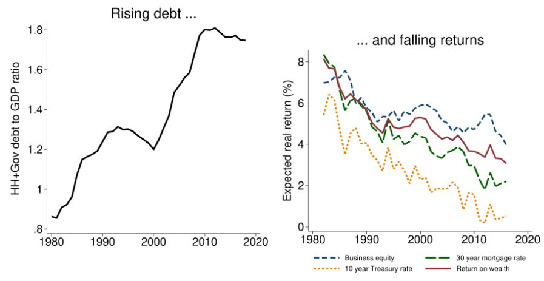

\hypersetup{linkcolor=black}
\renewcommand{\contentsname}{Innholdsfortegnelse}
\renewcommand*{\figureautorefname}{Figur}
\renewcommand*{\tableautorefname}{Tabell}
\renewcommand*{\equationautorefname}{Ligning}
\renewcommand*{\sectionautorefname}{Kapittel}
\renewcommand*{\subsectionautorefname}{Underkapittel}
\renewcommand*{\subsubsectionautorefname}{Delkapittel}
\tableofcontents
\hypersetup{linkcolor=blue}
\newpage
\thispagestyle{plain}
\begin{center}
    \Large
    \textbf{Sammendrag}
\end{center}

Denne gjennomgangen analyserer hvordan *Indebted Demand* av Mian, Straub og Sufi (2021) forklarer sammenhengen mellom inntektsulikhet, gjeld og den naturlige renten. Formålet er å redegjøre for artikkelens mekanisme, vurdere forutsetningene og drøfte hvor langt resultatene støttes av empirien. Artikkelen utvikler en teoretisk modell med sparere og låntakere som har ulike konsumresponser på endringer i permanent inntekt. Analysen kombinerer matematiske utledninger, sammenligning med en homotetisk referansemodell og kalibrerte simuleringer, supplert med eksisterende empirisk forskning. Under modellens forutsetninger kan større ulikhet og lettere kredittilgang føre til mer gjeld og lavere langsiktig naturlig rente. Gjeldsbetjening overfører ressurser til sparere, uten at deres økte konsum fullt ut oppveier låntakernes konsumfall. Dersom rentetilpasningen begrenses av en effektiv nedre grense, kan økonomien bli værende i en gjeldsfelle med produksjon under kapasitet. Gjennomgangen fremhever samtidig at den gjeldsfinansierte delen av stimulansen må skilles fra andre pengepolitiske kanaler, og at politikkresultatene avhenger av fordeling og finansiering. Artikkelens styrke er en sammenhengende forklaring på hvordan gjeld kan påvirke fremtidig etterspørsel. Begrensningen er at kalibrering og observerte sammenhenger ikke alene identifiserer mekanismens kausale betydning. Oppfølgende forskning understreker betydningen av boligformue, kredittbetingelser og forskjeller mellom husholdningsgjeld og selskapsgjeld.

\newpage

# Kontekst og metode

## Hva handler artikkelen om

Artikkelen undersøker samspillet mellom inntektsfordeling, gjeld og den naturlige renten. Det empiriske utgangspunktet er at amerikansk husholdningsgjeld og offentlig gjeld økte samtidig som avkastningskravene falt over tiårene før artikkelen ble skrevet.

{width=100%}

Figuren viser økende husholdningsgjeld og offentlig gjeld relativt til BNP, sammen med fallende forventet realavkastning på ulike aktiva. Sammenstillingen motiverer artikkelens forskningsspørsmål, men dokumenterer ikke alene en årsakssammenheng mellom gjeld og renter. Figurteksten viser til artikkelens nettappendiks C for nærmere opplysninger om datagrunnlaget [@mian2021indebted, s. 2243–2244].

Begrepet indebted demand viser til etterspørsel som er tynget av gjeldsbetjening. Oversettelsen "gjeldsdrevet etterspørsel" beskriver først og fremst oppgangen når lån tas opp, og kan derfor skjule artikkelens hovedpoeng: Gjeld kan finansiere konsum i dag og samtidig svekke etterspørselen senere.

## Hvilke spørsmål forsøker den å besvare

Tre spørsmål samler analysen: Hvordan kan større inntektsulikhet gi både mer gjeld og lavere renter? Hvorfor kan lettere kredittilgang senke den langsiktige renten, selv om låneetterspørselen først øker? Og når kan gjeldsfinansiert stimulans redusere rommet for fremtidig stabiliseringspolitikk?

## Hvilke metoder brukes

Forfatterne bygger en deterministisk modell med to husholdningstyper, sparere og låntakere, innenfor et rammeverk med generasjonsskifte og arv. Grunnmodellen har en gitt samlet produksjon. De utleder likevekter og overgangsforløp, sammenligner med en homotetisk[^1] referansemodell og utvider analysen med offentlig sektor, nominelle rigiditeter[^2] og investeringer [@mian2021indebted, del II–III og VI–IX].

[^1]: Homotetiske preferanser innebærer at optimale valg skaleres proporsjonalt når tilgjengelige ressurser øker og relative priser holdes faste. I artikkelens referansemodell gir dette samme skalerte konsum- og spareatferd uavhengig av formuesnivå.

[^2]: Nominelle rigiditeter refererer til situasjoner der priser og lønninger ikke justeres umiddelbart i respons til endringer i økonomiske forhold, noe som kan føre til midlertidige ubalanser i markedet.

Dette er primært teori, supplert med empirisk motivasjon og kalibrerte simuleringer. Kalibrering viser hva en modell kan frembringe med parametere valgt med støtte i data og tidligere forskning. Den er ikke i seg selv en kausal test av at mekanismen forklarer observerte data.

# Påstander og begrunnelse

## Hva er det sentrale nye bidraget

Nyheten er ikke observasjonen om at rike kan spare mer enn andre. Bidraget er å gjøre forskjeller i sparingstilbøyelighet fra **permanent inntekt** til en mekanisme som knytter gjeldsoppbygging til en lavere naturlig rente. Dette er mer spesifikt enn at enkelte husholdninger reagerer sterkt på en midlertidig utbetaling.

Mekanismen kan illustreres enkelt. La en varig økning i gjeldsbetjeningen på $x$ kroner overføre inntekt fra låntakere til sparere. Hvis deres marginale konsumtilbøyeligheter er henholdsvis $m_b$ og $m_s$ blir den direkte konsumvirkningen ved uendret rente:

$$
\Delta C = (m_s - m_b) x < 0
$$

når $m_b > m_s$.

Dette er en forenklet illustrasjon av fordelingskanalen, og ikke artikkelens eksakte dynamiske ligning. Konsumtilbøyelighetene må gjelde samme inntektsendring og tidshorisont.

En gjeldsbetaling er også en inntekt for mottakeren. Etterspørselen faller derfor bare dersom mottakerens konsumøkning ikke oppveier betalerens konsumfall. I grunnmodellens generelle likevekt justeres renten ned slik at varemarkedet klareres. Lavere produksjon følger derfor ikke automatisk [@mian2021indebted, s. 2259–2260].

Herfra følger to sentrale resultater under modellens forutsetninger. En større inntektsandel til sparerne senker den langsiktige renten og øker husholdningsgjelden. Lettere kredittilgang kan også gi mer gjeld og lavere langsiktig rente fordi den senere gjeldsbetjeningen styrker overføringen til sparerne [@mian2021indebted, proposisjon 4–5].

## Blir hypoteser avkreftet

Artikkelen avkrefter ikke standardmodeller gjennom statistisk hypotesetesting. Den viser at alternative antakelser om preferanser gir andre likevektsresultater. I den homotetiske referansemodellen bestemmes den langsiktige renten av sparernes diskonteringsrate. Med ikke-homotetiske preferanser kan fordelingen av ressurser påvirke den. Det er en teoretisk sammenligning, og ikke en empirisk forkastning.

## Hva sparekurven viser

Den nedadgående langsiktige sparekurven viser hvilken rente som gjør det optimalt å holde en bestemt formue konstant. Den beskriver ikke uten videre hvordan årlig sparing reagerer på en isolert renteøkning. Skillet er viktig fordi en betingelse for konstant formue ikke er det samme som en kortsiktig tilbudskurve for sparing [@mian2021indebted, s. 2256–2258].

## Hvordan begrunnes rimeligheten av antakelsene

Forfatterne begrunner forskjellene i konsum- og spareatferd med tidligere studier av sparing fra livsinntekt og konsumresponser på formue. De viser også til en positiv sammenheng mellom de høyeste inntektsandelene og forholdet mellom formue og inntekt. Dette gjør preferanseantakelsen empirisk motivert, men ikke entydig identifisert: En høy gjennomsnittlig sparerate er ikke nødvendigvis det samme som en høy marginal sparingstilbøyelighet fra permanent inntekt. Evidensen må derfor vurderes ut fra hva som faktisk måles, og om målet svarer til mekanismen i modellen [@mian2021indebted, del IV, s. 2265–2270].

# Relevans

## Vitenskapelig og samfunnsmessig relevans

Artikkelen viser hvorfor samlet gjeld ikke kan vurderes uavhengig av hvem som betaler og hvem som mottar betalingene. Den tilfører en fordelingskanal til analysen av lave naturlige renter. Den er også relevant fordi tiltak som gir samme etterspørselsøkning i dag, kan etterlate ulike gjeldsbyrder og dermed ulik etterspørsel senere.

### Pengepolitikk har flere kanaler

Proposisjon 7 skiller mellom økt konsum hos sparerne og økt lånefinansiert etterspørsel. Det er den gjeldsfinansierte delen som møter en senere motvirkning gjennom gjeldsbetjening. Påstanden om at pengepolitikk bare flytter etterspørsel frem i tid er derfor for vid. Artikkelen gir grunn til å undersøke sammensetningen av stimulansen, ikke til å avvise rentekutt generelt [@mian2021indebted, s. 2284–2285].

### Offentlig gjeld avhenger av finansieringen

Den langsiktige virkningen av offentlig gjeld avhenger av hvem som til slutt bærer skattene eller utgiftskuttene som finansierer gjeldsbetjeningen. Artikkelen diskuterer også særskilt avkastning på statsobligasjoner og mulige unntak når statsrenten ligger tilstrekkelig under vekstraten. Konklusjonen kan derfor ikke være at alle offentlige underskudd nødvendigvis svekker fremtidig etterspørsel. 

### Gjeldsfellen krever en bindende nedre grense

Når den naturlige renten ligger under den effektive nedre grensen, kan renten ikke justeres nok til å opprettholde full sysselsetting. Med nominelle rigiditeter kan økonomien da ha en stabil likevekt med produksjon under kapasitet. Dette er et betinget resultat, ikke en påstand om at enhver gjeldsøkning ender i en krise.

Her må tre størrelser holdes fra hverandre: nominell styringsrente, realrente og naturlig rente. Artikkelens effektive nedre grense for den relevante realavkastningen er ikke nødvendigvis null. Nullgrensen for nominell styringsrente må derfor ikke likestilles med en realrente på null [@mian2021indebted, s. 2287–2288].

### Omfordeling og gjeldslette

I modellens gjeldsfelle kan omfordeling øke produksjonen og være Pareto-forbedrende[^3]. Det er et velferdsresultat innenfor den spesifiserte modellen, ikke et generelt bevis for at enhver skatteøkning gjør alle bedre stilt. En engangs gjeldslette gir heller ingen varig endring i likevekten uten endringer i fordeling eller kredittbetingelser [@mian2021indebted, proposisjon 10–11].

[^3]: Pareto-forbedring betyr at minst én person får det bedre uten at noen andre får det verre.

# Hva videre forskning tilfører

## Hvilke spørsmål er fulgt opp

Studiene nedenfor siterer Indebted Demand, men de gjør forskjellige ting: videreutvikler teori, kartlegger gjeld eller undersøker kriser. De belyser dermed ulike deler av rammeverket, uten samlet å utgjøre en direkte test av hele årsaksmekanismen.

### Kan staten finansiere varige underskudd uten senere skatteøkninger

@mian2025goldilocks analyserer dette i A Goldilocks Theory of Fiscal Deficits. Uten en bindende nullgrense kreves mer enn at renten er lavere enn veksten: Også rentens respons på mer gjeld begrenser handlingsrommet. Ved nullgrensen kan for små underskudd svekke etterspørselen og nominell vekst og dermed øke gjeldsbelastningen.

Dette nyanserer finanspolitikken: Både utilstrekkelig stimulans og for store underskudd kan være problematiske. Den presise oppfølgingen er en analyse av betingelsene for finanspolitisk handlingsrom, ikke et bevis for at handlingsrommet alltid forsvinner ved nullrenten.

### Hvem lånte mer og hvilken rolle spilte boligformue

@bartscher2025distribution finner at gjeldsveksten etter 1980 særlig kom fra at husholdninger med gjeld lånte mer. Belåning av opparbeidet boligformue forklarer nesten halvparten av veksten. Den øvre halvdelen av inntektsfordelingen holdt gjennomgående minst 80 prosent av husholdningsgjelden.

Dette er ikke en enkel historie om at de fattigste låner for å kompensere for stagnerende inntekt. Min vurdering er at resultatene gjør boligpriser og sikkerhetsverdier nødvendige i en empirisk vurdering av gjeldskanalen. De identifiserer ikke i seg selv mekanismen i Indebted Demand.

### Kreves ikke-homotetiske preferanser

@brault2021carleton får frem en beslektet mekanisme i en modell med to perioder. De erstatter nøkkelantakelsen om ikke-homotetiske preferanser med blant annet en lånegrense som øker med ulikhet.

Resultatet viser at den samme typen dynamikk kan oppstå under andre antakelser. Det viser ikke at dynamikken er uunngåelig, og en modell med to perioder er ikke uten videre en modell med overlappende generasjoner.

### Er selskapsgjeld og husholdningsgjeld samme problem

@ivashina2025corporate knytter selskapsgjeld særlig til finanskriser, mislighold og svak investering. Husholdningsgjeld forbindes også med svakere vekst uten en finanskrise. Min vurdering er at studien skjerper skillet mellom kanaler: Prediksjon av kriser er ikke en direkte kausal test av etterspørselsmekanismen hos @mian2021indebted.

# Empirisk grunnlag og teoretisk analyse

Artikkelen er primært et teoretisk arbeid. Spørsmålene om data er likevel relevante fordi forfatterne bruker empiri til å motivere mekanismen, velge parametere og vurdere størrelsesordenen på modellens utslag. Nedenfor skilles det derfor mellom empirisk støtte, kalibrering og matematisk bevisføring.

## Hvilke data brukes og hvordan analyseres de

Det empiriske grunnlaget består av flere typer informasjon. Figur I viser amerikansk husholdningsgjeld og offentlig gjeld relativt til BNP, samt forventet realavkastning på ulike aktiva. Figur V sammenholder den øverste prosenten av inntektsfordelingens inntektsandel med samlet formue relativt til inntekt. Den ene sammenstillingen bruker amerikanske tidsserier for 1913–2019; den andre bruker endringer mellom amerikanske delstater fra 1982 til 2007. Dette er deskriptive sammenhenger. Forfatterne presiserer at delstatsfiguren viser korrelasjon, og viser til et annet arbeid for analyser med kontrollvariabler [@mian2021indebted, s. 2244 og 2268–2269].

I tillegg sammenfatter del IV resultater fra tidligere mikroøkonomiske studier av sparing fra livsinntekt og marginal konsumtilbøyelighet fra formue. Artikkelen presenterer dermed ikke ett nytt mikrodatamateriale som estimerer hele mekanismen direkte. Den bruker eksisterende empiriske resultater som støtte for modellens sentrale egenskaper.

Empirien brukes også i kalibreringen. I grunnmodellen representerer sparerne den øverste prosenten av husholdningene. Utgangspunktet tilpasses blant annet en husholdningsgjeld på 45 prosent av BNP i 1980, en vekstjustert realavkastning på 5,5 prosent og en marginal konsumtilbøyelighet fra formue hos sparerne på 0,01. Parameteren som styrer gjeldstilpasningen, velges ved å sammenholde modellens respons på et pengepolitisk sjokk med en empirisk respons [@mian2021indebted, s. 2263–2264].

I den utvidede modellen simuleres en økning i ulikhet. På lang sikt gir simuleringen omtrent tre prosentpoeng lavere rente og rundt 80 prosentpoeng høyere husholdningsgjeld relativt til BNP. Forfatterne påpeker at gjeldsøkningen er større enn den observerte økningen i USA frem til finanskrisen eller andre kvartal 2020. De langsiktige modellutfallene må dessuten skilles fra historiske endringer over en avgrenset periode. Simuleringen illustrerer derfor mekanismens mulige størrelse, men er ikke et bevis på at modellen forklarer hele utviklingen [@mian2021indebted, s. 2299–2301].

## Hvilke empiriske og kvantitative valg er viktigst

Det første viktige valget er å legge vekt på **permanent inntekt**, fordi teorien gjelder konsumresponsen på varige ressursendringer. En midlertidig inntektsøkning kan bli spart for å jevne ut konsumet og er derfor ikke en direkte test av den samme mekanismen. I figur V brukes likevel løpende toppinntektsandeler som tilnærming, fordi tilsvarende serier for livsinntekt ikke er tilgjengelige. Forfatterne begrunner dette med forskning som knytter veksten i løpende ulikhet til økt ulikhet i livsinntekt [@mian2021indebted, s. 2268, fotnote 26].

Det andre valget er å representere fordelingen med **to husholdningstyper** og tolke sparerne som den øverste prosenten. Det gjør modellen håndterbar og retter oppmerksomheten mot gruppen som eier mye formue, men skjuler variasjon i likviditet, alder, gjeld og eiendeler innad i gruppene.

Det tredje valget gjelder **avkastningsmål og kalibreringsmål**. Modellrenten knyttes til avkastning på formue og justeres for produktivitetsvekst; den er ikke identisk med nominell styringsrente. Videre velges preferanseparametere blant annet for å treffe sparernes konsumrespons på formue. At modellen treffer et mål som brukes i kalibreringen, er ikke en uavhengig bekreftelse av modellen. En sterkere vurdering undersøker også hvordan modellen forklarer forhold som ikke ble brukt til å velge parameterne.

## Hvordan kunne andre valg endret arbeidet

Med flere husholdningsgrupper kunne analysen undersøkt om det er inntekt, likvid formue eller gjeldsbelastning som er mest avgjørende for konsumresponsen. En husholdning med høy boligformue kan samtidig ha lite disponible midler og høy gjeldsbetjening. Det er derfor ikke gitt at en grov inndeling etter inntekt fanger den viktigste forskjellen mellom betalere og mottakere.

Et annet valg av konsumrespons hos sparerne ville endret styrken på fordelingskanalen. Hvis sparernes konsumøkning var nærmere låntakernes konsumfall, ville etterspørselsvirkningen blitt svakere. I den homotetiske referansemodellen forsvinner den aktuelle langsiktige effekten av økt ulikhet på rente og gjeld. Dette viser at preferansevalget bærer et sentralt resultat; det er ikke bare en teknisk detalj.

Forfatterne undersøker selv enkelte alternativer. I del IX varierer de blant annet substitusjonsmulighetene mellom kapital og arbeidskraft og husholdningenes forventninger til fremtidig ulikhet. Disse valgene påvirker overgangsforløpet og styrken på utslagene. Varianten uten perfekt forutseenhet endrer den første renteresponsen, men ikke den endelige renten og gjelden i det aktuelle eksperimentet. Robustheten gjelder dermed de undersøkte alternativene, ikke alle mulige modeller [@mian2021indebted, s. 2299–2300].

Et alternativt empirisk arbeid kunne brukt endringer i gjeldsbetalinger som ikke skyldes husholdningenes forventede inntekt eller konsum, og deretter målt responsen hos både betalere og mottakere. Det kunne gitt sterkere identifikasjon av én del av mekanismen. Å beregne virkningen på den naturlige renten ville fortsatt krevd en modell for hvordan individuelle responser summeres og påvirker resten av økonomien.

## Hva beviser forfatterne og hvordan

Bevisførselen tar utgangspunkt i husholdningenes nyttemaksimering, budsjettbetingelser og lånebegrensning. Forfatterne utleder sparerens Euler-ligning, som beskriver avveiningen mellom konsum nå og senere. I en stasjonær likevekt er formuen konstant, slik at sparerens budsjettbetingelse kan skrives $c^s = ra^s$. Når denne settes inn i Euler-ligningen, får de følgende langsiktige sammenheng [@mian2021indebted, ligning (9), s. 2256–2257]:

$$
r(a^s)=\rho\frac{1+\delta/\rho}{1+(\delta/\rho)\eta(a^s)}
$$

Her er $a^s$ sparernes formue, $\rho$ diskonteringsraten, $\delta$ dødsraten og $\eta(a^s)$ funksjonen som beskriver styrken på arvemotivet relativt til den homotetiske referansen. Når $\eta'(a^s)>0$, øker nevneren med formuen. Dermed faller renten som er forenlig med konstant formue. Dette er kjernen i proposisjon 1 om en nedadgående langsiktig sparekurve.

Denne betingelsen kombineres med låntakernes langsiktige gjeldsetterspørsel, $d=\ell/r$, der $\ell$ bestemmer lånekapasiteten. Proposisjon 2 karakteriserer likevekten. Deretter viser proposisjon 3 at en liten, permanent overføring fra låntakere til sparere reduserer samlet konsum på virkningstidspunktet når renten holdes fast og den relevante ikke-homotetisiteten er positiv. Låntakerens konsum faller én til én med betalingen, mens sparerens konsum øker mindre. I generell likevekt må renten derfor tilpasses for å gjenopprette balanse [@mian2021indebted, s. 2258–2260].

Videre brukes komparativ statikk og dynamisk analyse til å utlede virkninger av ulikhet, kredittbetingelser og politikk. Når nominelle rigiditeter og en effektiv nedre rentegrense innføres, viser proposisjon 9 at en stabil gjeldsfelle med produksjon under kapasitet kan eksistere. De matematiske resultatene er dermed betingede utsagn: De følger av modellens antakelser og likevektskrav. Simuleringene illustrerer forløp og størrelsesordener; de erstatter ikke den analytiske bevisførselen [@mian2021indebted, del V–VII].

## Hvilke antakelser bygger resultatene på

**Ikke-homotetiske preferanser.** Den sentrale antakelsen er at sparernes sparetilbøyelighet fra permanent inntekt er høyere enn låntakernes. I modellen knyttes dette til at $\eta(a)$ øker med formuen. Det betyr ikke at marginalnytten av arv isolert sett må øke; den kan avta langsommere enn i den homotetiske referansen. Uten denne egenskapen får ikke grunnmodellen den samme langsiktige fordelingskanalen [@mian2021indebted, s. 2251 og 2257–2260].

**To dynastier og begrenset mobilitet.** Sparere og låntakere har ulik ressurstilgang, og grunnmodellen ser bort fra mobilitet mellom dynastiene. Dette isolerer forskjellene mellom gruppene, men utelater livsløpsendringer og variasjon innad i dem.

**En spesifisert lånebegrensning.** Låntakerne kan ikke fritt låne mot alle fremtidige inntekter. Lånegrensen og hastigheten på gjeldstilpasningen påvirker både likevekten og overgangen dit. En fullstendig modell av banker, mislighold og konkurskostnader inngår ikke i grunnmodellen.

**Gitt produksjon og forutseenhet i grunnmodellen.** Den grunnleggende bytteøkonomien har gitt produksjon og et deterministisk aggregert forløp. Forfatterne undersøker senere investeringer og enkelte alternative forventningsforløp. Det er derfor nødvendig å skille grunnmodellens antakelser fra dem som brukes i utvidelsene.

**Nominelle rigiditeter og en bindende nedre grense for gjeldsfellen.** Disse er nødvendige for det spesifikke resultatet om vedvarende produksjon under kapasitet. Mekanismen som senker den naturlige renten, krever derimot ikke i seg selv at økonomien befinner seg ved rentegrensen. Politikkresultatene avhenger dessuten av hvem som bærer finansieringen og av hvordan gjelden brukes [@mian2021indebted, del VI–VIII].

## Hvorfor kan teorien gi innsikt når antakelsene ikke er fullt oppfylt

Modellens verdi ligger i at den isolerer en økonomisk sammenheng: Gjeldsbetalinger flytter kjøpekraft mellom aktører som kan reagere ulikt med konsumet. Denne kanalen kan være relevant selv om det finnes mange husholdningstyper, usikkerhet og sosial mobilitet. Den kvalitative innsikten krever ikke at alle detaljer i togruppemodellen er bokstavelig riktige, men den krever at forskjellen mellom de relevante konsumresponsene faktisk består.

Artikkelen viser også at utvidelser ikke bare er tillegg uten betydning. Når gjeld finansierer produktive investeringer, kan større produksjonskapasitet og endrede faktorinntekter motvirke etterspørselsbelastningen. Proposisjon 13 åpner for en positiv umiddelbar etterspørselsvirkning i enkelte tilfeller. Det er derfor bruken av gjelden og de samlede inntektsvirkningene som må undersøkes, ikke bare gjeldsnivået [@mian2021indebted, s. 2294–2295].

Teorien gir dermed et rammeverk for å formulere og undersøke spørsmål, men ikke en ubetinget prognose. Min vurdering er at den er særlig nyttig når den brukes til å undersøke hvem som betaler, hvem som mottar, hvordan begge grupper endrer konsumet, og om rente- eller produksjonstilpasning motvirker den direkte effekten. Hvor stor samlet virkning dette får, må vurderes empirisk.

# Konklusjon

*Indebted Demand* viser hvordan inntektsfordeling og gjeldsbetjening kan påvirke samlet etterspørsel og den naturlige renten. Når låntakere reduserer konsumet mer enn sparerne øker sitt, må renten falle for å opprettholde likevekt. Dersom en effektiv nedre grense hindrer denne tilpasningen, kan økonomien bli værende med produksjon under kapasitet. Artikkelen gir dermed en sammenhengende forklaring på hvordan økende gjeld og fallende renter kan opptre samtidig.

Den viktigste styrken er at mekanismen utledes eksplisitt og kobles til pengepolitikk, finanspolitikk og omfordeling. Samtidig er konklusjonene betinget av preferanser, lånebegrensninger og finansieringsmåter. Empiriske sammenstillinger og kalibrerte simuleringer gjør teorien relevant, men viser ikke alene hvor mye av den historiske renteutviklingen mekanismen forklarer. At den kvantitative modellen anslår en større langsiktig gjeldsøkning enn den observerte, understreker behovet for å vurdere både størrelsesordener og modellforenklinger.

Min samlede vurdering er derfor at artikkelen gir et viktig teoretisk bidrag til forståelsen av gjeld og etterspørsel, mens den empiriske oppgaven fortsatt er å identifisere fordelingskanalens styrke og skille den fra andre forklaringer. Videre forskning bør særlig undersøke begge sider av gjeldsbetalingene og forskjellene mellom lån til konsum, bolig og produktive investeringer.

\clearpage

# Referanser {.unnumbered}

::: {#refs}
:::

\clearpage

# Vedlegg om bruk av KI {.unnumbered}

I arbeidet med denne teksten er ChatGPT brukt til å utarbeide et forslag til sammendrag, fylle ut spørsmål om empirisk grunnlag og teoretisk metode, omorganisere avslutningen og rette språk og referanser. Forslagene er utarbeidet med utgangspunkt i den innsendte teksten og forskningsartikkelen. KI-bearbeidingen erstatter ikke studentens egen faglige vurdering og kildekontroll før innlevering.

Når jeg skriver kode i Visual Studio Code eller RStudio, bruker jeg en plugin som heter GitHub Copilot. Denne pluginen foreslår kode eller tekst mens jeg skriver. Forslag aksepteres når de samsvarer med det jeg ønsker å gjøre. Kodekommentarer som beskriver en ønsket operasjon, kan ha vært brukt til å få forslag fra Copilot. Mer informasjon om verktøyet er tilgjengelig på <https://github.com/features/copilot>.
